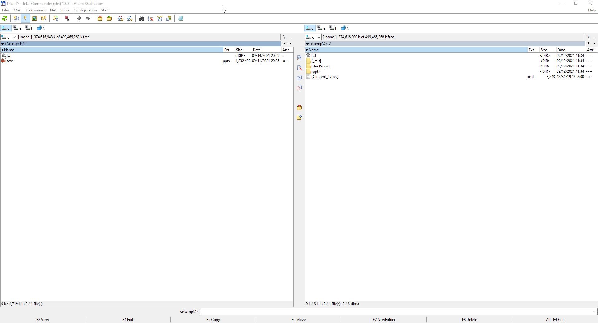

# Contributing to ShapeCrawler

A big welcome and thank you for considering contributing to ShapeCrawler open source projects!

Reading and following these guidelines will help us make the contribution process easy and effective for everyone involved. It also communicates that you agree to respect the time of the developers managing and developing these open source projects. In return, we will reciprocate that respect by addressing your issue, assessing changes, and helping you finalize your pull requests.

## Recomended tools
The internal structure of PowerPoint presentation is one the most difficult among other documents from the Microsoft Office suite. For example, the slide presented for a user is not a single document but only top on Slide Layout and Slide Master slides. Even just that levels frequently lead to confusion. The following is a list of tools and notes that should simplify your development while working on ShapeCrawler's issue.

- **[OOXML Viewer](https://marketplace.visualstudio.com/items?itemName=yuenm18.ooxml-viewer)** — extension for Visual Studio Code allowing to view Open XML package. One of the good features of this extension is track changes of modified presentation.
- **[Open XML SDK 2.5 Productivity Tool](https://github.com/OfficeDev/Open-XML-SDK/releases/tag/v2.5)** — application for generating C#-code from Open XML document. It can be useful, for example, when you wanna know what C#-code is needed to add a new shape or slide.
- **.pptx is ZIP** — do not forget that .pptx-file is a zip file as well as other Open XML documents. Thus you can rename the extension of the presentation file on .zip and watch his internals:



## Code style and conventions

### Code style

SC-001: Public members except interface should have "SC" prefix

```c#
public class Bullet // invalid
{
    
}

public class SCBullet // valid
{
    
}
```

SC-002: Public members that contain an instance of a type from Open XML SDK should have "SDK" prefix

```c#
public class SCPresentation
{
    public DocumentFormat.OpenXml.Packaging.SlidePart SlidePart { get; } // invalid
}

public class SCPresentation
{
    public DocumentFormat.OpenXml.Packaging.SlidePart SDKSlidePart { get; } // valid
}
```

### Test file

- test file should math the following pattern `ShapeCrawler.Tests\Resorce\{shape-type}\{shape-type}-case{N}.pptx`, eg. testing file for testing feature for Chart: `ShapeCrawler.Tests\Resorce\charts\charts-case001.pptx`.
- if possible use single slide presentation.